# Meesterproef 2019

## Table of Contents

1. [Introduction](#Introduction)
2. [Focus points](#Focus-points)
3. [Design rational](#Design-rational)
4. [Product biography](#Product-biography)
5. [Reflection](#Reflection)
6. [License](#License)

## Introduction

During the master test I worked on a project for [Wallscope](https://wallscope.co.uk/).
Wallscope is a company based in Edinburgh, Scotland.

I did this project together with three others: [Chelsea Doeleman](https://github.com/chelseadoeleman), [Jesper Ingels](https://github.com/jesperingels) and [Maikel Sleebos](https://github.com/Senpaizuri).
While working together we all tried to learn something new and fun. Some parts of design process had some overlap, but we each tried to scope our own pieces of the application. What that learning meant for me can be read later on.

During this 5 week period we created an experience which enabled medical students, medical researchers and reporters alike to work together on creating _digital cases_.
These digital cases were formed by searching the Wallscope datasystem, in an intuitive manner, and then group them together in one such case. A case can be a collaboration between multiple users of the system.
Wallscope gets this data from the [NHS](https://www.scot.nhs.uk/), which is the National Healthcare System of Scotland.

To provide the most use out of the system, we also decided not to restrict the basic search functionality behind an _account wall_. If you were to not be logged in, you simply wouldn't be able to participate in any of the _case_ related activities of the platform.

The project repository can be found [here](https://github.com/Maikxx/360-wallscope).

## Focus points

* **Web App From Scratch**
    * Structure the application modularly. ✅
    * Unit testing. ✅
    * Actor / Interaction / Data flow diagrams.
    * Refactoring ✅
    * _Nice to have_ -> end-to-end testing.
* **CSS To The Rescue**
    * Use [BEM](http://getbem.com/) and [SCSS](https://sass-lang.com/) to structure stylesheets. ✅
* **Browser Technologies**
    * _Nice to have_ -> Progressive enhancement with [Next.js](https://nextjs.org/).
* **Web design**
    * User tests
* **Performance Matters**
    * Create performing [PostgreSQL](https://www.postgresql.org/) queries. ✅
    * _Nice to have_ -> Minimize all outgoing files.
* **Real-Time Web**
    * Smart data management. [Redux](https://redux.js.org/)? Global state? Happy flow -> Client first, trace back in case of an error.

## Design rational

## Product biography

## Week 1

During the first week we were greeted by Antero from [Wallscope](https://wallscope.co.uk/) at the AUAS.
We did some initial exchanging of ideas and started talking about logistics of our visit to Edinburgh.

I have to say we had the option to work together with UX designers on this project, but this teamwork didn't feel very good from the start, so we decided to separate ways and each do our own.

We unfortunately only had one day to start planning things out, due to the massive public transport strike in the Netherlands that second day.

Besides this, we made it work and went to Edinburgh on wednesday. We had this day and the evenings to do some touristy stuff.

We of course also did some work on thursday and friday. We were greeted by a lot of people from different kinds of companies representing Scotland, including [Wallscope](https://wallscope.co.uk/) itself and the [NHS](https://www.scot.nhs.uk/).
On the first workday we mainly did concepting and project scoping (which we did a poor job of seen afterwards).

Even though most reading this, probably know I don't really like this phase, I still think it is very important to bring a good service to life, which is why I happily participated in the brainstorming processes.
I also did some design research, like the rest of the group on friday, mainly looking at examples of similar systems on Pinterest. On [this Pinterest board](https://nl.pinterest.com/chelsea_doelema/wallscope-web-dev/) you can view my influx of design inspiration.

After doing some design research we all decided to take on the challenge to start designing something in Adobe XD. The result of this can be found [here](https://github.com/Maikxx/360-wallscope/blob/master/docs/BRIEFING_1.md).

    
Adobe XD designs from me

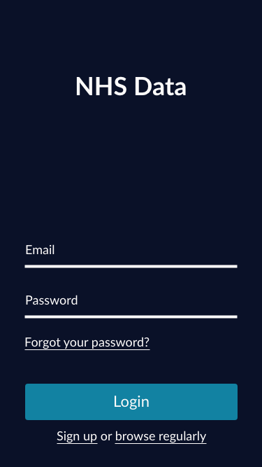
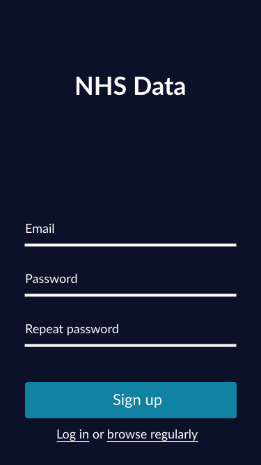
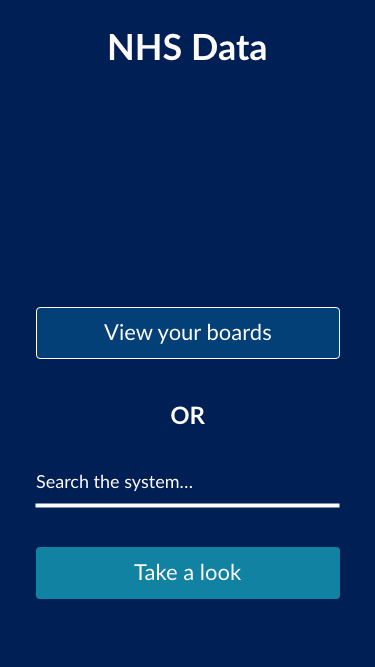
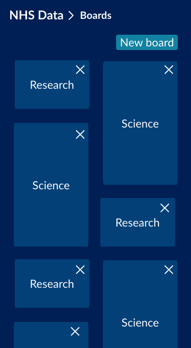
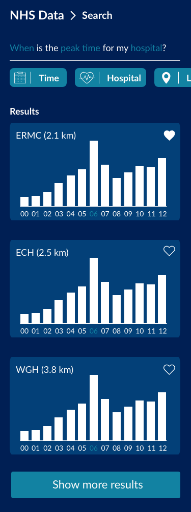
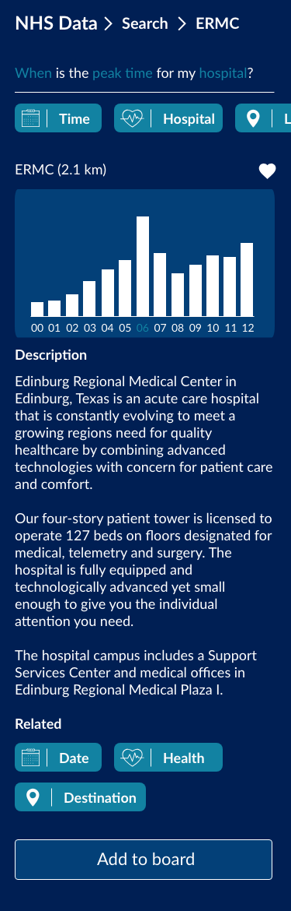
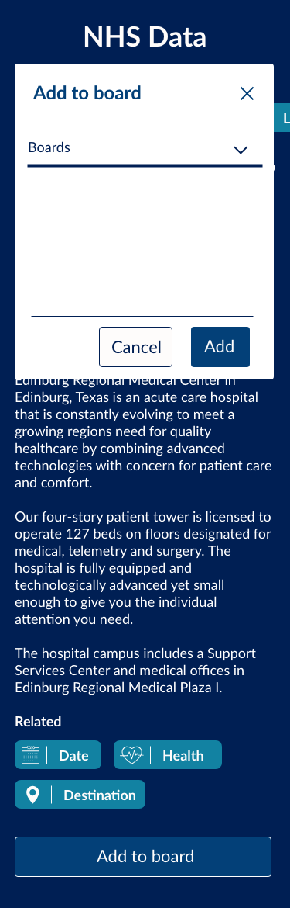
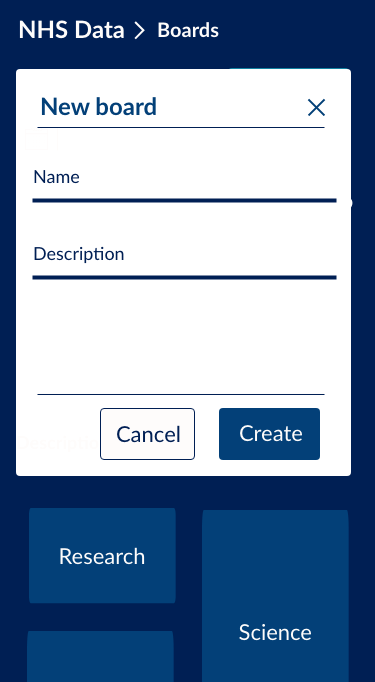
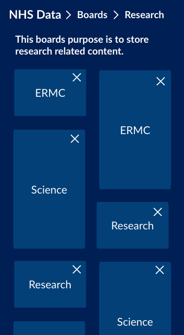
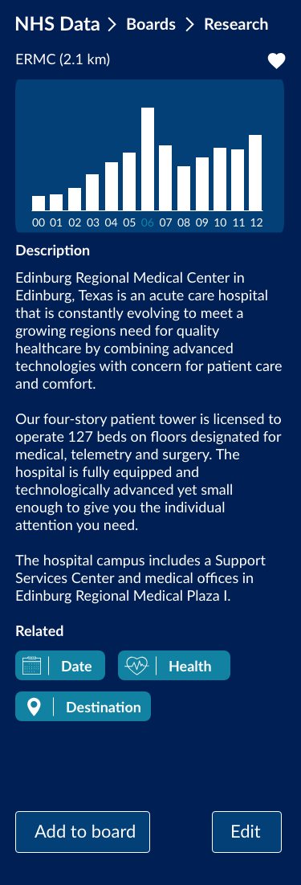
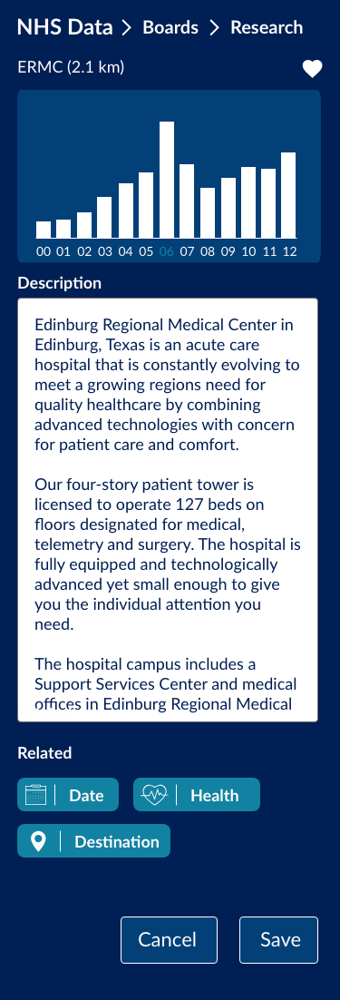

After us all designing something, we had to give a presentation to the full crowd at the end of the friday, where we presented our findings and first designs. Maikel S. and me did the presentation, although I didn't speak one word. I only was there for the case where he lost track, which he didn't, which was great.

We unfortunately did not have time to talk with Joost about our progress this week.

## Week 2

During the second week we quickly had a talk with Joost about our concepts for the project.
We pretty much got to hear what we had already thought, which was that the concept was too broad and difficult to really make something fun out of.

We decided to take the route which lead to our current concept at the moment of writing, which is written above. We Skype called [Wallscope](https://wallscope.co.uk/) about this in the afternoon to confirm this concept was still useful for them, which they confirmed it was.

They also noted a couple of new technologies for me, to might start using if we were to try out [Natural Language Processing](https://en.wikipedia.org/wiki/Natural_language_processing) on our own: [Solr](http://lucene.apache.org/solr/) and Solid, which is a backend framework (I believe).

At the start of this week I still focussed on improving that design that was created the week before.
At some point we all decided to start merging things together into one design and to stick with that.
Frankly, it was a mix of a lot of our designs combined into one.

You can find more about these updated designs [here]([here](https://github.com/Maikxx/360-wallscope/blob/master/docs/BRIEFING_3.md)).

Chelsea decided to merge the other designs into hers, since we all thought her designs were the furthest and best.

For the rest of the week I mainly started my technical (lead, which I think is a very stupid thing to name myself but it kind of has some sense to it) role. I started creating the full boilerplate in [React](https://reactjs.org/), [TypeScript](https://www.typescriptlang.org/) and [SCSS](https://sass-lang.com/).
At this point I still thought a little bit about myself too much, which I stubbed my toe on later, since I didn't realize these technologies were not common to everyone.

We collectively decided to continue using [React](https://reactjs.org/) as it was the easiest of the three major frameworks to learn for all.

After building this boilerplate a wild _marshmallow_ occurred (as [Elastique](https://elastique.nl/) likes to call it), since I did not yet think of combining a server into this contraption. Rewriting this was kind of a challenge, which took me pretty much the whole week, while the rest started creating [React](https://reactjs.org/) components.

As the server language I took [Node.js](https://nodejs.org/en/) wrapped in [TypeScript](https://www.typescriptlang.org/) with a [PostgreSQL](https://www.postgresql.org/) database, since I thought this was best for performance and the database still challenged me enough to learn a lot.

I tried to teach the others some basic structuring things like [these version control guidelines](https://github.com/Maikxx/360-wallscope/blob/master/docs/guidelines/VERSION_CONTROL.md) and some [React](https://reactjs.org/) and [TypeScript](https://www.typescriptlang.org/) introductions during this week also.

When I did a talk with Joost, it pretty much confirmed that I already had the Web App From Scratch course in the pocket, however that I needed more focus points, mainly for myself to learn. For example, the addition of real-time connectivity if it was possible in context and time, as well as the ability for me to learn something about Unit and End-to-end testing.

All of these aspects I put on the [GitHub project board](https://github.com/Maikxx/360-wallscope/projects/1) as _nice to haves_ initially. Here you will also find all the things that I worked on.

### Week 3

During the third week we continued where we had left of. For me personally that meant working on the server more, while also helping the others out with some [React](https://reactjs.org/) and [TypeScript](https://www.typescriptlang.org/) questions.

When I had the code review with Laurens, I didn't have too much focus points for this project prepared yet, which made it go not so smoothly.

I decided for myself after this talk that I wanted to learn more about all the types of diagrams we have come across in this minor, so made myself a goal to create one of each for the application that we are building.
As far as the application structure that I set up myself, it falls into both Web App From Scratch and CSS To The Rescue, by creating a modular boilerplate with technologies such as [React](https://reactjs.org/), [SCSS](https://sass-lang.com/) and [BEM](http://getbem.com/).

I also wanted to throw some things into the mix which might or might not fall into one of the courses, but which lead me to learning something new, so I went for them anyway.
This includes mainly the use of a performing database like [PostgreSQL](https://www.postgresql.org/) to improve the performance of the application.
When talking about this with Laurens he also noted that you can fake performance on the client side as well, by having a global state system and using a _happy flow_.
A really big goal for me was to render everything server side (with the help of [Next.js](https://nextjs.org/)), since I had never done that before and wanted to know more about it, however the more this gets pushed back, the less likely it will become that I will take on this goal during this project, due to the scale it already takes.

I also added _user testing_ to the list, because the other people of the group also have this goal, and this will happen either way. Besides the fact that it is an easy tick off, I wanted to try this again, because during the course _Web Design_ I only get to test twice, for quite a short period of time.

Halfway this week we started to get into trouble, since we did receive the data (and [SparQL](https://en.wikipedia.org/wiki/SPARQL) queries) from [Wallscope](https://wallscope.co.uk/) yet.

Our infrastructure now started to heavily rely on this data, which also lead me to have some moments of anger, because I could simply not continue working in the _conceptual coding_ way that I like to work. The things that I needed to do got too complicated to do in this conceptual way, and I needed real data to test if my assumptions worked.

We reached out to [Wallscope](https://wallscope.co.uk/) for this issue and they responded within half a day with a lot of helpful new things, like a data sample set, which I have no idea yet how to get around at this point.

On thursday I started to take on the challenge of **unit testing**, which appeared to be not such a big challenge if done well. I think that I will write an article about this. The awesome thing that happened here when installing these unit testing service ([mocha](https://mochajs.org/) and [chai](https://www.chaijs.com/)) and started writing little tests for something I though would go right always, didn't pass the tests, due to a typo in the actual code that was being tested! Great stuff, there is the real value!

I also decided to **refactor** the whole server, since it was about to drive me nuts. I had files with 400 lines of code in it, with a lot of repetition. I split these files up into smaller ones, and removed the repetition where possible. I hope it now scales a little bit more, so that I can work on it for two more weeks without losing my mind (this is the largest server project that I have built to date, so yeah).

On thursday we planned a Skype meeting with Ian from Wallscope on friday at 2pm. In the morning before this meeting Chelsea and I had a skype call with Joost about the progress that we made. After this call, we pretty much stressed a lot, seeing as though we really fell behind due to the lack of data provided.

I started to focus on the work the others had left behind on thursday, so that we had something new to show to Wallscope, unfortunately due to the insane time stress that we had, I broke something, which I could not fix in time for the Skype call... It happens.

I decided it would be best to show Wallscope the updated designs and explain why we didn't get a lot done this week and hope for a better week, next week. Luckily they accepted this train of thought. For the rest of the afternoon I worked on trying to fix that what I had broken, which has got to be one of the most frustrating coding afternoon ever.

I didn't get the thing to work in the way that I wanted it to work and the way it worked on other places in the application, so I once again decided to outsmart the system by writing a hacky solution to get it to work either way.
I did however first try to ask for help to people, which I normally never really do, so that is also something new. This, unfortunately though, did not help. Meaning I had to go the hacky solution way.
Maybe I just wasn't fully focussed on the project this afternoon. It did, however, made me realize not everything will go well right away. This counts for all aspects in life too. Life lessons learned from such a stupid moment while working on a project are always the most valuable.

### Week 4

In the first few days of week four a lot of things went wrong, communication with Wallscope, and the fact that we were terribly behind on schedule.
Also, as some teachers have noticed, my personal motivation vanished quickly, which made it way harder for me to crawl upon schedule.

I mainly worked on getting some integration done in the application in the first few days, although it went very slowly. Here it is that I started to notice this job will definitely not be suitable for me full-time, which is also good to know, I guess.

When talking with Joost, he told me to focus on creating a solid working layer, over trying to get everything to work a little bit, which is what we then all started focussing on. This also meant that I would now start to fake things and rush in order for us to reach the deadline.

This also meant that I didn't focus a lot anymore on clean data management, real-time connectivity or performance.

I did, however, end up rewriting some queries to be way faster, using PostgreSQL `joins`. Which I learned about during this test.

I also started refactoring a lot of code to meet my refactor goal.

When speaking to Laurens, I had to express that I am totally burnt out with this project and that I no longer am able to do a lot more things to the project.

The final days of this week I mainly started to focus on writing the articles and documentation for the weekly mingles.

I also heard from Joost, Koop and Laurens that I had already showed my skills and shouldn't focus on achieving a lot more of the goals and focus on getting better.

### Week 5

At the start of this week I mainly focussed on getting the production environment ready to deploy to.

Besides that I started to work on the documentation of the application and my own reflection.

## Reflection

### Web App From Scratch

When creating this application, I decided (in coordination with the rest of the group) to build the **boilerplate from scratch** (as in, not using create-react-app).

I set up the application with TypeScript, ReactJS, Express and PostgreSQL.
The goal of doing this, was to create a modular application that scales quite well.

Although I did have some experience creating boilerplates before, I had never built anything the scale of this project before, mainly regarding the server and database.

I came across a lot of hurdles and if I had to do this project again, I would have not started with creating all the "required" endpoints to get data from the server and instead would start to build it alongside the client. Because of time issues I had created endpoints, which we didn't use at all. This also meant a lot of features were missing.

Another thing that I would change is that I would only start to set up data models when I actually had received the data that would need to be in the system. I now had to guess a lot of the time and that guessing cost me a lot of time in the end. As Laurens said, only start working on something once you have received everything you need in order for the system to work.

I ended up also writing a few **unit tests** for some server functions. I found that I would need a lot more time to get these unit tests everywhere in the application and on the more difficult code functions. That's why I decided to not focus on this as much, instead focus on getting the application working in time. TypeScript is a good help for avoiding errors on the frontend as well. So that helps me justify the fact that I didn't go all the way in this topic.

When working together on such an application a lot of **refactoring** is also in place, meaning I had to do that a lot to create the most modular and reusable code for the case that Wallscope would go further with this current codebase.

I said **end-to-end testing** was a nice addition to the breakable nature of client-side rendered applications. That is exactly what it stayed as, a nice addition, since I didn't have time for this anymore. I do however, when I have energy for it again, want to take this one up, since it looks very valuable to me.

I wanted to originally also add the **actor, interaction and data flow diagrams** but seen the current situation that might or might not still be workable.

In summary, I think the most things that I learned during these few project weeks are regarding teamwork and how to structure things so that it is not only for me logical, but also for the other co-workers. The goal for me was not to learn a lot of new things, but rather help others learn a lot of new things.

I asked them if they felt helped by me at the times that I explained some new things to them and they said "yes". I do know, however, that I need to take a slower approach when explaining things. For me they are often very sensible, and then I explain them in the speed that I can work with them.

### CSS To The Rescue

Although I did not style a lot of the application myself during these past few weeks, I did convince everyone to use SCSS and BEM to structure the code.
This helped us all create code standards, so that they can be passed on to Wallscope if they wanted to have this code at all.
I like to think that I helped them learn another piece of new methodology, BEM, since most of them hadn't used this before.
Structuring code is always important, but especially when working with larger scale projects, where you work in collaboration with other developers.

### Browser Technologies

I added this goal as a nice to have to the learning goals. Because of a lack of time I didn't get to do this learning goal.
This means that there is barely any progressive enhancement in this application, since the client is rendered by React, which is not on the server. This means that in the case of JavaScript failing to load, there will be nothing shown to the page.
I would like to continue learning new ways to work with my favourite frontend framework of this time, in a progressively enhanced manner, when I have the time in the future.

### Web design

As a part of web design, we did a user test with a medical student. We tested mainly the design of the application, to check if there was something missing or something needed to be different.
We had some things that we needed to change in order for him to use it happily. Although this was not a goal I focussed on heavily, I felt like including it anyway, since I did in fact participate in the test and asked some questions which where important for the result of this test.

### Performance Matters

Creating a performing application was for me one of the most important learning goals, seeing as there was the most to be learned for me here.
You can take the basic performance optimizations, like including the compress package in the express configuration, however, I felt like the best way to increase performance in the application, was by writing good SQL queries, since SQL is way faster at handling getting data from multiple tables than doing the equivalent in JavaScript.
Before this project I had never worked with `join`s, which meant I tried to do all the logic SQL is actually best at in JavaScript, which made the queries very, very slow, since I had to merge multiple objects and arrays together.
I only scratched the surface of what's possible with SQL and performance in this language, for that matter.
I will definitely need more exercise doing this to be able to call myself somewhat skilled in working with SQL and performing queries.

### Real-Time Web

Although I did initially liked the focus of this goal the most, seeing as though I think the mentality of this way of writing code is way more enjoyable for the end user, I did not have the time to make this work.
I have read up some things about this happy flow coding pattern.
What I would have done if I had more time, is to create a centralized store on the client, where all data lives for the current user, so that the initial page load might take a little longer, but then all the following requests to the server are handled in the background, while the store is being updated synchronously. This results in a happy flow, where the user (ideally) never has to wait for responses from a server, which makes it look like everything works in a real-time way, while in fact it just stores things on the client immediately, while asynchronously sending the request to the server, only giving an error and tracing back when the server responses with something else than status 200.
Taking on this pattern is really interesting, since it also takes on the challenge of increasing perceived performance, which is part of the Performance Matters course.

## License

This repository is licensed as [MIT](LICENSE) by [Maikel van Veen](https://github.com/maikxx).