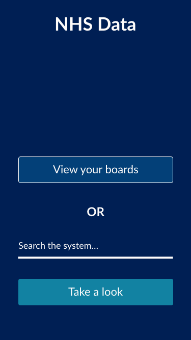
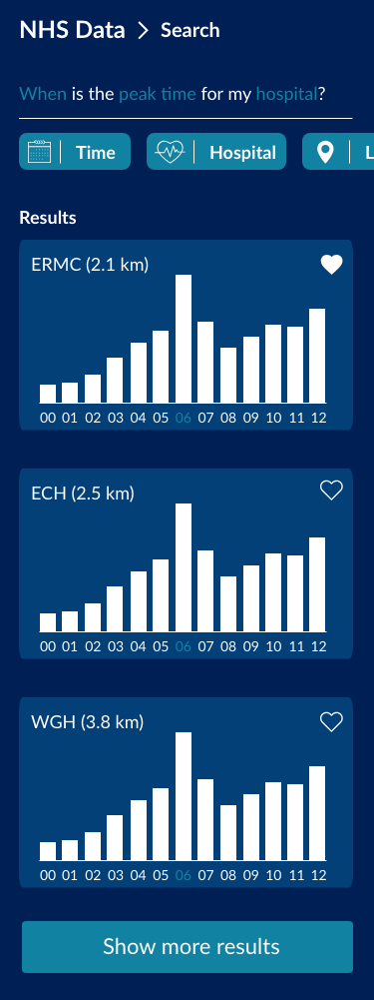
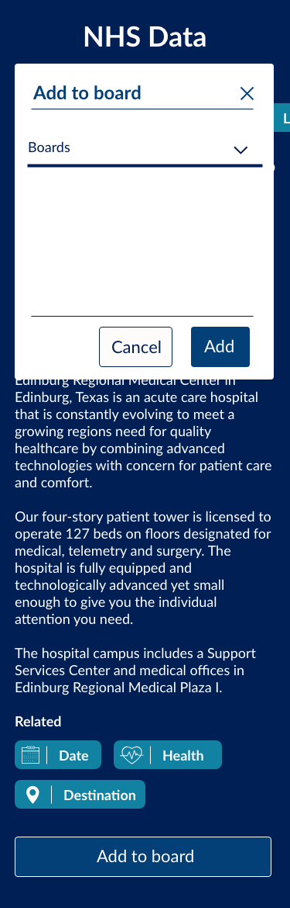
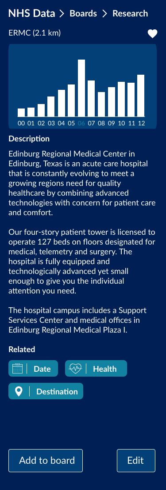

# Product Biography

## Table of Contents

* [Process](#Process)
* [Design Brief & Planning](#Design-Brief-&-Planning)
    * [Design Brief](#Design-Brief)
    * [Planning](#Planning)
* [Research & Inspiration](#Research-&-Inspiration)
* [Ideas & Insights](#Ideas-&-Insights)
* [Product Development](#Product-Development)

## Process

### Week 1

During the first week we were greeted by Antero from [Wallscope](https://wallscope.co.uk/) at the AUAS.
We did some initial exchanging of ideas and started talking about logistics of our visit to Edinburgh.
In this project we are creating a digital tool, to help people from Scotland work with the data that is structured by Wallscope, provided by the NHS.

We chose to focus on medical students and researchers to provide a more specialized tool, instead of a very broad one.

Before starting on this project we had received a few links from Emma, an employee from Wallscope, about the case and some background information.
I decided that it was best to read upon myself and also take a look at how their current solution works.

I have to say we had the option to work together with UX designers on this project, but this teamwork didn't feel very good from the start, so we decided to separate ways and each do our own.

We unfortunately only had one day to start planning things out, due to the massive public transport strike in the Netherlands that second day.

Besides this, we made it work and went to Edinburgh on wednesday. We had this day and the evenings to do some touristy stuff.

We of course also did some work on thursday and friday. We were greeted by a lot of people from different kinds of companies representing Scotland, including [Wallscope](https://wallscope.co.uk/) itself and the [NHS](https://www.scot.nhs.uk/).
On the first workday we mainly did concepting and project scoping (which we did a poor job of seen afterwards).

Even though most reading this, probably know I don't really like this phase, I still think it is very important to bring a good service to life, which is why I happily participated in the brainstorming processes.
I also did some design research, like the rest of the group on friday, mainly looking at examples of similar systems on Pinterest. On [this Pinterest board](https://nl.pinterest.com/chelsea_doelema/wallscope-web-dev/) you can view my influx of design inspiration.

After doing some design research we all decided to take on the challenge to start designing something in Adobe XD. The result of this can be found [here](https://github.com/Maikxx/360-wallscope/blob/master/docs/BRIEFING_1.md).

    
Adobe XD designs from me

After us all designing something, we had to give a presentation to the full crowd at the end of the friday, where we presented our findings and first designs. Maikel S. and me did the presentation, although I didn't speak one word. I only was there for the case where he lost track, which he didn't, which was great.

We unfortunately did not have time to talk with Joost about our progress this week.

### Week 2

During the second week we quickly had a talk with Joost about our concepts for the project.
We pretty much got to hear what we had already thought, which was that the concept was too broad and difficult to really make something fun out of.

We decided to take the route which lead to our current concept at the moment of writing, which is written above. We Skype called [Wallscope](https://wallscope.co.uk/) about this in the afternoon to confirm this concept was still useful for them, which they confirmed it was.

They also noted a couple of new technologies for me, to might start using if we were to try out [Natural Language Processing](https://en.wikipedia.org/wiki/Natural_language_processing) on our own: [Solr](http://lucene.apache.org/solr/) and Solid, which is a backend framework (I believe).

At the start of this week I still focussed on improving that design that was created the week before.
At some point we all decided to start merging things together into one design and to stick with that.
Frankly, it was a mix of a lot of our designs combined into one.

You can find more about these updated designs [here]([here](https://github.com/Maikxx/360-wallscope/blob/master/docs/BRIEFING_3.md)).

Chelsea decided to merge the other designs into hers, since we all thought her designs were the furthest and best.

For the rest of the week I mainly started my technical (lead, which I think is a very stupid thing to name myself but it kind of has some sense to it) role. I started creating the full boilerplate in [React](https://reactjs.org/), [TypeScript](https://www.typescriptlang.org/) and [SCSS](https://sass-lang.com/).
At this point I still thought a little bit about myself too much, which I stubbed my toe on later, since I didn't realize these technologies were not common to everyone.

We collectively decided to continue using [React](https://reactjs.org/) as it was the easiest of the three major frameworks to learn for all.

After building this boilerplate a wild _marshmallow_ occurred (as [Elastique](https://elastique.nl/) likes to call it), since I did not yet think of combining a server into this contraption. Rewriting this was kind of a challenge, which took me pretty much the whole week, while the rest started creating [React](https://reactjs.org/) components.

As the server language I took [Node.js](https://nodejs.org/en/) wrapped in [TypeScript](https://www.typescriptlang.org/) with a [PostgreSQL](https://www.postgresql.org/) database, since I thought this was best for performance and the database still challenged me enough to learn a lot.

I tried to teach the others some basic structuring things like [these version control guidelines](https://github.com/Maikxx/360-wallscope/blob/master/docs/guidelines/VERSION_CONTROL.md) and some [React](https://reactjs.org/) and [TypeScript](https://www.typescriptlang.org/) introductions during this week also.

When I did a talk with Joost, it pretty much confirmed that I already had the Web App From Scratch course in the pocket, however that I needed more focus points, mainly for myself to learn. For example, the addition of real-time connectivity if it was possible in context and time, as well as the ability for me to learn something about Unit and End-to-end testing.

All of these aspects I put on the [GitHub project board](https://github.com/Maikxx/360-wallscope/projects/1) as _nice to haves_ initially. Here you will also find all the things that I worked on.

### Week 3

During the third week we continued where we had left of. For me personally that meant working on the server more, while also helping the others out with some [React](https://reactjs.org/) and [TypeScript](https://www.typescriptlang.org/) questions.

When I had the code review with Laurens, I didn't have too much focus points for this project prepared yet, which made it go not so smoothly.

I decided for myself after this talk that I wanted to learn more about all the types of diagrams we have come across in this minor, so made myself a goal to create one of each for the application that we are building.
As far as the application structure that I set up myself, it falls into both Web App From Scratch and CSS To The Rescue, by creating a modular boilerplate with technologies such as [React](https://reactjs.org/), [SCSS](https://sass-lang.com/) and [BEM](http://getbem.com/).

I also wanted to throw some things into the mix which might or might not fall into one of the courses, but which lead me to learning something new, so I went for them anyway.
This includes mainly the use of a performing database like [PostgreSQL](https://www.postgresql.org/) to improve the performance of the application.
When talking about this with Laurens he also noted that you can fake performance on the client side as well, by having a global state system and using a _happy flow_.
A really big goal for me was to render everything server side (with the help of [Next.js](https://nextjs.org/)), since I had never done that before and wanted to know more about it, however the more this gets pushed back, the less likely it will become that I will take on this goal during this project, due to the scale it already takes.

I also added _user testing_ to the list, because the other people of the group also have this goal, and this will happen either way. Besides the fact that it is an easy tick off, I wanted to try this again, because during the course _Web Design_ I only get to test twice, for quite a short period of time.

Halfway this week we started to get into trouble, since we did receive the data (and [SparQL](https://en.wikipedia.org/wiki/SPARQL) queries) from [Wallscope](https://wallscope.co.uk/) yet.

Our infrastructure now started to heavily rely on this data, which also lead me to have some moments of anger, because I could simply not continue working in the _conceptual coding_ way that I like to work. The things that I needed to do got too complicated to do in this conceptual way, and I needed real data to test if my assumptions worked.

We reached out to [Wallscope](https://wallscope.co.uk/) for this issue and they responded within half a day with a lot of helpful new things, like a data sample set, which I have no idea yet how to get around at this point.

On thursday I started to take on the challenge of **unit testing**, which appeared to be not such a big challenge if done well. I think that I will write an article about this. The awesome thing that happened here when installing these unit testing service ([mocha](https://mochajs.org/) and [chai](https://www.chaijs.com/)) and started writing little tests for something I though would go right always, didn't pass the tests, due to a typo in the actual code that was being tested! Great stuff, there is the real value!

I also decided to **refactor** the whole server, since it was about to drive me nuts. I had files with 400 lines of code in it, with a lot of repetition. I split these files up into smaller ones, and removed the repetition where possible. I hope it now scales a little bit more, so that I can work on it for two more weeks without losing my mind (this is the largest server project that I have built to date, so yeah).

On thursday we planned a Skype meeting with Ian from Wallscope on friday at 2pm. In the morning before this meeting Chelsea and I had a skype call with Joost about the progress that we made. After this call, we pretty much stressed a lot, seeing as though we really fell behind due to the lack of data provided.

I started to focus on the work the others had left behind on thursday, so that we had something new to show to Wallscope, unfortunately due to the insane time stress that we had, I broke something, which I could not fix in time for the Skype call... It happens.

I decided it would be best to show Wallscope the updated designs and explain why we didn't get a lot done this week and hope for a better week, next week. Luckily they accepted this train of thought. For the rest of the afternoon I worked on trying to fix that what I had broken, which has got to be one of the most frustrating coding afternoon ever.

I didn't get the thing to work in the way that I wanted it to work and the way it worked on other places in the application, so I once again decided to outsmart the system by writing a hacky solution to get it to work either way.
I did however first try to ask for help to people, which I normally never really do, so that is also something new. This, unfortunately though, did not help. Meaning I had to go the hacky solution way.
Maybe I just wasn't fully focussed on the project this afternoon. It did, however, made me realize not everything will go well right away. This counts for all aspects in life too. Life lessons learned from such a stupid moment while working on a project are always the most valuable.

### Week 4

In the first few days of week four a lot of things went wrong, communication with Wallscope, and the fact that we were terribly behind on schedule.
Also, as some teachers have noticed, my personal motivation vanished quickly, which made it way harder for me to crawl upon schedule.

I mainly worked on getting some integration done in the application in the first few days, although it went very slowly. Here it is that I started to notice this job will definitely not be suitable for me full-time, which is also good to know, I guess.

When talking with Joost, he told me to focus on creating a solid working layer, over trying to get everything to work a little bit, which is what we then all started focussing on. This also meant that I would now start to fake things and rush in order for us to reach the deadline.

This also meant that I didn't focus a lot anymore on clean data management, real-time connectivity or performance.

I did, however, end up rewriting some queries to be way faster, using PostgreSQL `joins`. Which I learned about during this test.

I also started refactoring a lot of code to meet my refactor goal.

When speaking to Laurens, I had to express that I am totally burnt out with this project and that I no longer am able to do a lot more things to the project.

The final days of this week I mainly started to focus on writing the articles and documentation for the weekly mingles.

I also heard from Joost, Koop and Laurens that I had already showed my skills and shouldn't focus on achieving a lot more of the goals and focus on getting better.

### Week 5

At the start of this week I mainly focussed on getting the production environment ready to deploy to.

Besides that I started to work on the documentation of the application and my own reflection.

When doing a final briefing with Joost on tuesday, we came across a lot, a lot of bugs. Which meant we had to fix a lot of things in just under a day before presenting to the client.
I took upon me the more technical and otherwise difficult issues on me.

## Design Brief & Planning

### Design Brief

### Objectives & Goals

Initially the client (Wallscope) wanted to have effectively a redesign of the NHS website.
From the start, I thought this was a really boring task, which killed all my motivation to work on this project.
When we as a group contacted Joost about this, he also confirmed this feeling.
Then we had to call with Wallscope to confirm our new idea.

### Planning

| Date(s)           | Activity                                                                   |
|-------------------|----------------------------------------------------------------------------|
| Every monday      | Call with Wallscope about the progress                                     |
| Every friday      | Project coaching                                                           |
| 22-5-19           | Research provided case data                                                |
| 27-5-19           | Project briefing at AUAS                                                   |
| 29-5-19 / 1-6-19  | Concept inspiration visit to Edinburgh, Scotland, including design research |
| 3-6-19 / 4-6-19   | Finalize concept mock-ups                                                   |
| 5-6-19 / 7-6-19   | Set-up development boilerplate                                              |
| 10-6-19 / 22-6-19 | Development on the product                                                 |
| 24-6-19 / 26-9-19 | Documentation                                                              |
| 27-9-19           | Deadline                                                                   |

To view the changes (which there are a lot of) to the planning, please refer to [this](#Process).

## Research & Inspiration

Before even starting the project, I started to research the case a little bit more, with the data Wallscope provided to us.

The first article I read was about [triple stores](https://medium.com/wallscope/linked-data-a-conceptual-exploration-9860a1f44d68?source=friends_link&sk=a4a70e4b3af9326157a0386981a0a84f). After reading this article from them it kind of made sense, but still kind of didn't, because I didn't see the benefit of using this over joined SQL tables with described relations.
After taking some time to take this information in, it started to make sense, seeing as the relations are set in the data explicitly, instead of implicitly, which can (on large scale applications), save a lot of time thinking about relations.

During the first few days of the project, we all took upon ourselves to find inspirational interfaces which could be meaningful to us.
We mainly started to look at inspiration for _dashboards_ and _native mobile applications_, as well as _infographics_, _charts_, _graphs_ and _data visualizations_.

As a team we created a shared [Pinterest board](https://nl.pinterest.com/chelsea_doelema/wallscope-web-dev/) to store our inspiration research in, on which I also participated to search for inspiration.

We also received some of their current visualizations, which I felt like definitely needed improvement, due to the fact that they may or may not convey meaning, but look like crap.

* [Prescribed medicines](https://www.isdscotland.org/Health-Topics/Prescribing-and-Medicines/Publications/2019-05-14/visualisation.asp)
* [A&E Waiting times](https://www.isdscotland.org/Health-Topics/Emergency-Care/Publications/2019-05-07/Summary/index.asp)
* [Mental health](https://www.isdscotland.org/Health-Topics/Mental-Health/Publications/2018-09-25/psychiatric-inpatient-activity/?28376406432)

As a team, we also did an interview with a medical student in week 4.
I wasn't the interview leader, but came up with a few smart questions for the person on the fly. For example, since we created designs in a so called **dark mode** (mainly because of my own personal feelings towards **non-dark mode** interfaces), I asked him if he would rather use a **light mode** over a dark mode.
This question came up to me, because he said that he worked barely late at night, which is when dark modes are most often used.
He felt the interfaces color scheme was a little too dark and depressing for working during the day, and would feel like having the light mode by default over the dark mode.

For further detail on the interview and what other things came from it, please refer to [this document](https://github.com/Maikxx/360-wallscope/blob/master/docs/USER_TEST.md).

As a learning goal that I set for myself, I wanted to learn something about unit testing (in Node applications specifically).

Here is what I found, and used as a basis to write my [article about unit testing](https://github.com/Maikxx/weekly-nerd-1819/blob/master/articles/UNIT_TESTING.md):

* [https://www.tsmean.com/articles/how-to-write-a-typescript-library/unit-testing/]()
* [https://journal.artfuldev.com/unit-testing-node-applications-with-typescript-using-mocha-and-chai-384ef05f32b2?gi=cb0aac915670]()
* [https://medium.com/@RupaniChirag/writing-unit-tests-in-typescript-d4719b8a0a40]()
* [https://wanago.io/2019/02/04/typescript-express-testing/]()
* [https://wanago.io/2019/02/04/typescript-express-testing/]()
* [https://mochajs.org/]()
* [https://www.chaijs.com/]()

## Ideas & Insights

From researching **unit testing** applications with TypeScript, Mocha and Chai, I learned that this is a whole new can of worms to open.
I found it to be very difficult to combine my personal goal to learn a bit about unit testing with the development of the project, which is why I didn't go very far in depth.
When I did a unit test on some piece of code I took for granted though, it did break, twice. Once because of a typo, and the other time because it was just bad code.
This lead me to forget the fact to take everything for granted. I could really see the use in unit testing after this, although creating fake mocks and integrating tests in the code with database calls provided to be way too difficult.

After performing the **user test**, though, I got reminded to the fact that no one human is alike, and that my personal thoughts didn't overlap with a potential users thoughts.
This was very much the truth in the case of the **dark mode** of the application.
I always have every application that has a dark mode, switched to dark mode, always. So after testing, it appeared that this application was not really the right place for a dark mode (at least for that users context).

## Product Development

Although I did personally not sketch a lot of things during this project, I did keep a [process document](#Process) up-to-date and also created a [simple design](https://github.com/Maikxx/360-wallscope/blob/master/docs/BRIEFING_3.md).

Also, to take a look at what particular things I worked on in this project, feel free to take a look here, at the [GitHub project](https://github.com/Maikxx/360-wallscope/projects/1), where we all assigned tasks to ourselves to take on.

To view the final application, [click here](https://wallscope.herokuapp.com).